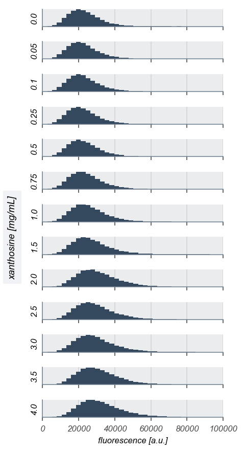
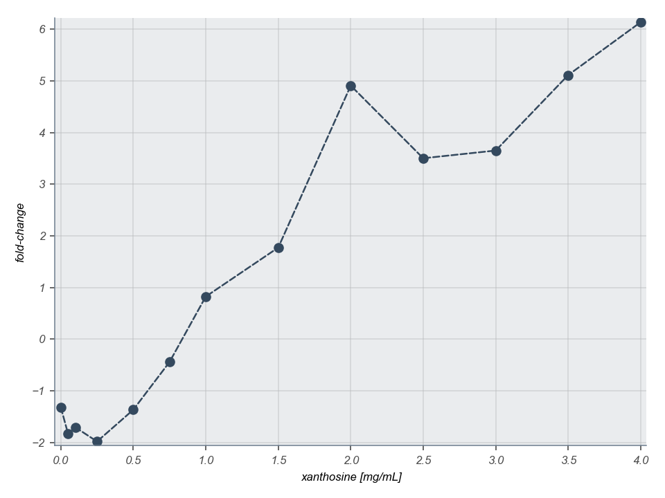

# 2019-02-04 Xanthosine Titration Curve

## Purpose 
A xanthosine titration curve with the simple activation promoter with low
concentrations of xanthosine. 
## Strains
| **Location** | **Plasmid** | **Genotype** | **Shorthand** |
|:--| :--| :--| :--| 
|`Box 1-XX`| `N/A`| *xapABR::FRT-FRT* | `∆xap`|
|`Box 1-XX`| `N/A`| *galK::28-YFP, xapABR::FRT-FRT* |`simp-YFP`|
|`Box 1-28`| *pN25-tetR*| *ybcN::1-xapR-mCherry, galK::28-YFP, xapABR::FRT-FRT*| `simp-YFP + xapR`|

## Inducer concentrations
| **Inducer** | **Shorthand**| **Concentration(s)** |
|:--|:--| :--|
| Anhydrous tetracycline| ATC|  10 \[ng/mL\]|
| Xanthosine dihydrate | XAN | 0, 0.05, 0.1, 0.25, 0.5, 0.75, 1, 1.5, 2, 2.5, 3, 3.5, 4\[mg/mL\]|

## Notes & Observations
* Concentrations were prepared via a serial dilution from the highest
  concentration (4 mg/mL).  This may explain fluctuations in concentration.
* Because the highest concentration was not 100% soluble, the final
  concentration is questionable. 
## Processing Files

**Distribution evolution**

**Fold-change** 

### Cell Husbandry
1. All strains given in the table above were grown in LB + appropriate
   antibiotic overnight (reaching saturation) and were in stationary phase. 
2. The previous night, the appropriate amount of Xanthosine was weighed into the
  appropriate 15 mL Falcon tubes.
3. The following morning, 3 mL of M9 + 0.5% glucose was added to each tube (±
   xanthosine) followed by the appropriate antibiotic (if necessary) and
   concentration of ATC. ATC was diluted from 1µg/mL stock. 
4. Cells were diluted 1000 fold into the media and allowed to grow for ~ 8 hours
   shaking 225 rpm at 37°C. The tubes were shielded from light to prevent
   photocleavage of the ATC. 
5. After 8 hours, the cultures were removed from incubation and prepared for
  flow cytometry.

## Flow Cytometry
1. Cells were diluted 1:10 into M9 minimal medium with no supplemented carbon to
  suppress growth and further expression. 

